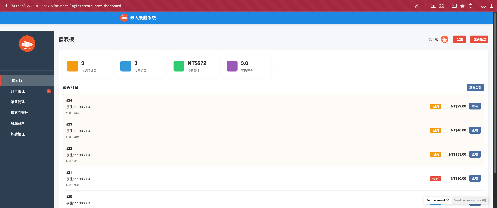

# 🍽️ Restaurant Management System

一個現代化的餐廳管理系統，提供完整的點餐、評價和管理功能。

## 🚀 功能特色

- 🔐 完整的身份驗證系統
- 📊 即時訂單追蹤和統計
- ⭐ 客戶評價系統
- 📱 響應式設計，支援多種設備
- 🔄 即時數據更新
- 📈 銷售數據分析

## 🛠️ 技術棧

### 前端
- Vue.js 3
- Vue Router
- Vuex
- Axios
- TailwindCSS

### 後端
- Node.js
- Express.js
- JWT 認證
- MySQL

### 開發工具
- Vite
- ESLint
- Prettier
- Git

## 📸 系統截圖

### 儀表板


主要功能：
- 待處理訂單：0
- 今日訂單：0
- 今日營收：NT$0
- 平均評分：2.9
- 詳細評分數據：
  - 食物評分：3.00
  - 服務評分：2.58
  - 環境評分：3.08
  - 總體評分：2.88
  - 總評價數：24

## 🚀 快速開始

1. 克隆專案
```bash
git clone https://github.com/111306084/restaurant-management
cd restaurant-management
```

2. 安裝依賴
```bash
# 前端
npm install

# 後端
cd backend
npm install
```

3. 設置環境變數
```bash
cp .env.example .env
# 編輯 .env 文件設置你的環境變數
```

4. 啟動開發服務器
```bash
# 前端 (根目錄)
npm run serve

# 後端
cd backend
npm run dev
```

## 📝 API 文檔

API 文檔可在 [這裡](docs/api.md) 找到詳細說明。

## 🤝 貢獻指南

歡迎提交 Pull Request 或開 Issue 討論新功能。

## 📄 授權

本專案使用 MIT 授權 - 詳見 [LICENSE](LICENSE) 文件
